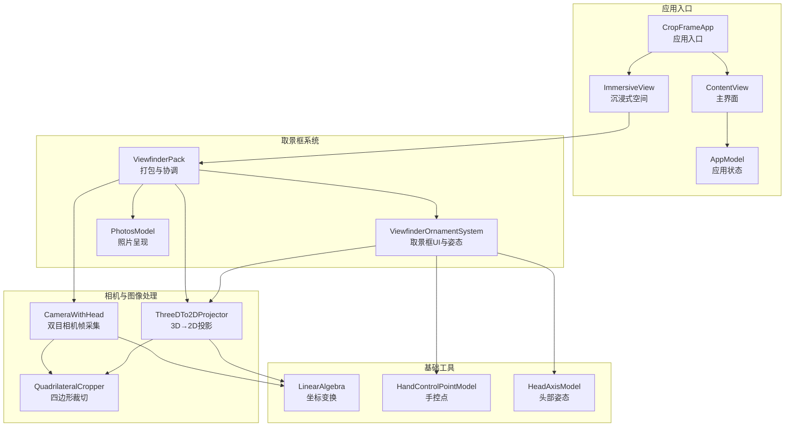
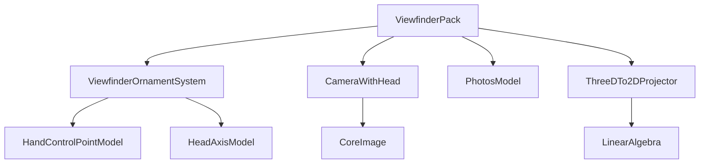
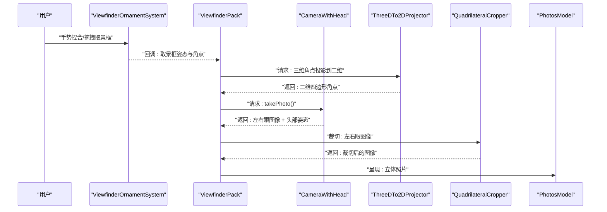
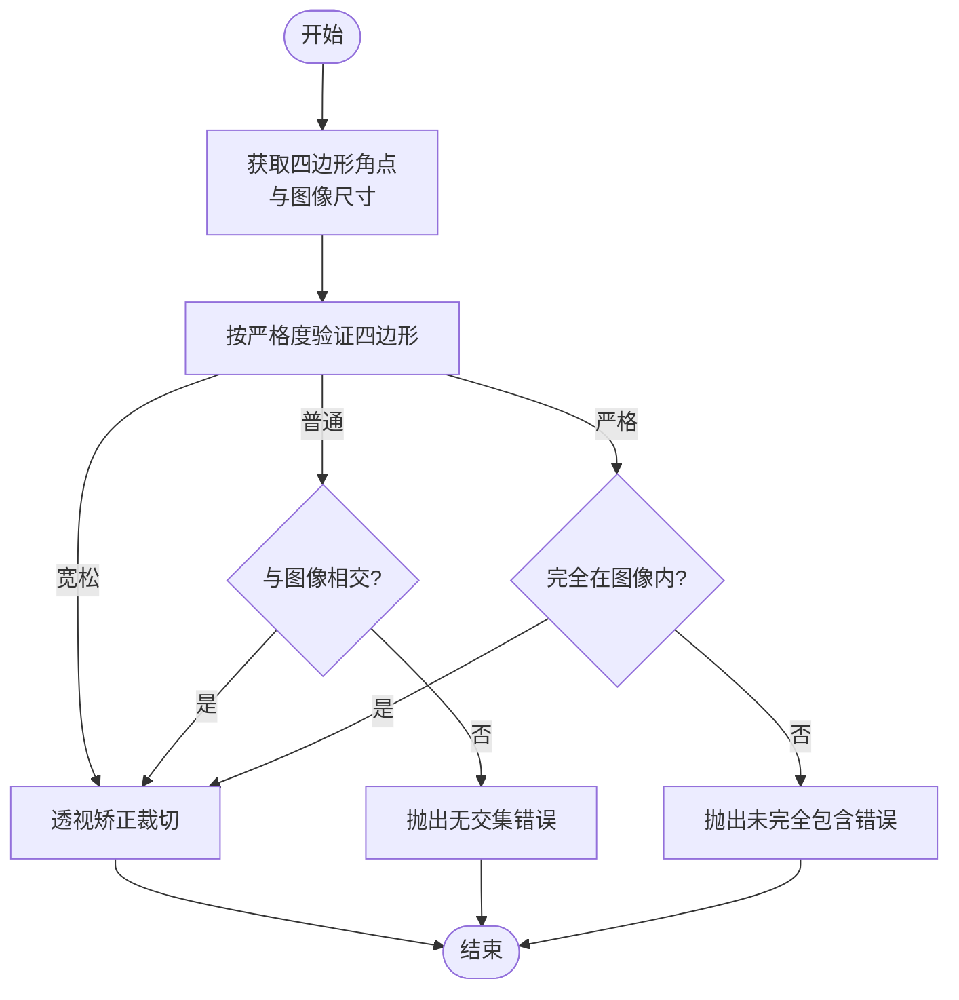
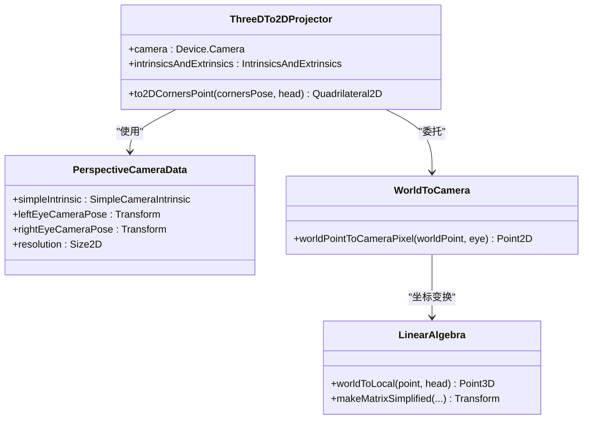
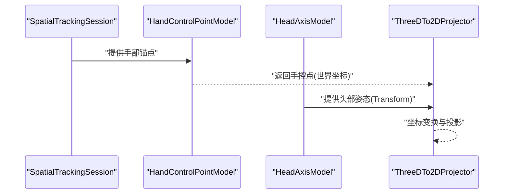
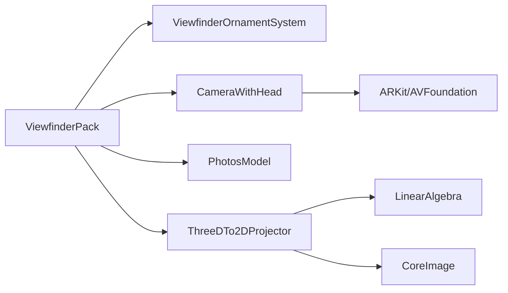

# 项目概述

## 目录
1. [简介](#简介)
2. [项目结构](#项目结构)
3. [核心组件](#核心组件)
4. [架构总览](#架构总览)
5. [详细组件分析](#详细组件分析)
6. [依赖关系分析](#依赖关系分析)
7. [性能考虑](#性能考虑)
8. [故障排除指南](#故障排除指南)
9. [结论](#结论)
10. [附录](#附录)

## 简介
CropFrameOpenSource 是一个基于 SwiftUI 和 RealityKit 构建的 Apple Vision Pro 沉浸式取景框应用，专注于双目摄影与立体视觉技术。其核心目标是通过手势驱动的取景框控制、头部追踪、四边形透视变换与立体照片生成，为用户提供直观、沉浸式的双目摄影体验。

项目主要特性包括：
- 手势驱动的取景框控制：通过双手食指与拇指中心点定位，实现对取景框的捏合、拖拽与旋转，无需物理控制器。
- 头部追踪：实时获取设备在世界坐标系中的姿态，确保取景框与用户头部运动同步。
- 四边形透视变换：将三维取景框的四个角点投影到双目相机的二维图像平面，形成可裁切的四边形区域。
- 立体照片生成：对左右眼图像进行四边形裁切与透视矫正，输出可用于立体显示的双目图像。

技术栈选择的优势：
- SwiftUI：声明式 UI 开发，便于快速迭代与跨界面一致性；结合 RealityKit 的沉浸式空间场景管理。
- RealityKit：强大的 3D 渲染与场景管理能力，支持沉浸式空间、实体与修饰器的组合使用。
- ARKit：提供世界跟踪与相机访问权限，支撑头部姿态与双目相机帧流的稳定获取。
- CoreImage：高性能图像处理与透视变换，保证裁切与投影过程的流畅与准确。

应用场景与价值：
- 影视与媒体制作：在沉浸式环境中精确构图与拍摄立体素材。
- 教育与培训：通过立体视觉增强教学与演示效果。
- 科研与测量：利用双目视觉进行三维重建与距离测量。
- 创意内容创作：为 VR/AR 内容创作者提供高效的取景与拍摄工具。

## 项目结构
项目采用按功能域划分的模块化组织方式，核心目录与职责如下：
- CropFrame：应用入口与资源
  - CropFrameApp.swift：应用入口，定义窗口与沉浸式空间场景。
  - ContentView.swift：主界面，包含设置与沉浸式空间入口。
  - ImmersiveView.swift：沉浸式空间主视图，承载 RealityKit 场景与取景框系统。
  - AppModel.swift：应用级状态管理（沉浸式空间状态）。
  - Info.plist 与 CropFrame.entitlements：系统配置与权限声明。
- Content/Models：核心业务模型
  - CameraWithHead：双目相机帧采集与降噪、拍照流程。
  - QuadrilateralCropper：四边形裁切与透视矫正。
  - 3DTo2DProjector：三维点到二维像素的投影计算。
  - Foundations：线性代数、手控点与头部姿态等基础工具。
- Content/Views：界面与视图
  - ViewfinderUI：取景框 UI 与姿态系统（未在当前上下文展开）。
  - Photos：照片展示与立体材质（未在当前上下文展开）。
- Assets.xcassets：应用图标与资源。

**图表来源**
- [CropFrameApp.swift](CropFrame/CropFrameApp.swift#L1-L25)
- [ContentView.swift](CropFrame/Content/ContentView.swift#L1-L100)
- [ImmersiveView.swift](CropFrame/Content/ImmersiveView.swift#L1-L37)
- [AppModel.swift](CropFrame/AppModel.swift#L1-L22)
- [ViewfinderPack.swift](CropFrame/Content/ViewfinderPack.swift#L1-L188)
- [CameraWithHead.swift](CropFrame/Content/Models/CameraWithHead/CameraWithHead.swift#L1-L188)
- [Cropper.swift](CropFrame/Content/Models/QuadrilateralCropper/Cropper.swift#L1-L311)
- [Projector.swift](CropFrame/Content/Models/3DTo2DProjector/Projector.swift#L1-L408)
- [LinearAlgebra.swift](CropFrame/Content/Models/Foundations/LinearAlgebra.swift#L1-L116)
- [HandControlPointModel.swift](CropFrame/Content/Models/Foundations/HandControlPointModel.swift#L1-L65)
- [HeadModel.swift](CropFrame/Content/Models/Foundations/HeadModel.swift#L1-L43)

**章节来源**
- [CropFrameApp.swift](CropFrame/CropFrameApp.swift#L1-L25)
- [ContentView.swift](CropFrame/Content/ContentView.swift#L1-L100)
- [ImmersiveView.swift](CropFrame/Content/ImmersiveView.swift#L1-L37)
- [AppModel.swift](CropFrame/AppModel.swift#L1-L22)
- [Info.plist](CropFrame/Info.plist#L1-L24)
- [CropFrame.entitlements](CropFrame/CropFrame.entitlements#L1-L9)

## 核心组件
- 应用入口与场景管理
  - CropFrameApp：定义窗口组与沉浸式空间，注入 AppModel 状态。
  - ContentView：提供设置面板与沉浸式空间入口按钮。
  - ImmersiveView：在 RealityKit 中添加世界原点与 ViewfinderPack，并监听沉浸式空间开闭状态。
  - AppModel：维护沉浸式空间状态机（关闭/过渡/打开）。
- 取景框系统
  - ViewfinderPack：对外统一接口，协调取景框 UI、相机与照片呈现。
  - ViewfinderOrnamentAndCameraAndPhotos：内部编排，负责运行取景框系统、启动相机、获取内外参、触发拍照与裁切。
- 相机与图像处理
  - CameraWithHead：启动 ARKit 会话与相机帧提供器，持续缓存最新帧，拍照时进行降噪并返回左右眼图像与头部姿态。
  - QuadrilateralCropper：在后台线程执行透视矫正，支持宽松/普通/严格三种裁切严格度。
  - ThreeDTo2DProjector：根据设备姿态与相机内外参，将三维角点投影到二维像素坐标。
  - Foundations：线性代数工具、手控点与头部姿态模型，支撑坐标变换与姿态获取。
- 权限与配置
  - Info.plist：声明沉浸式空间与多场景支持。
  - CropFrame.entitlements：启用主摄像头访问权限。

**章节来源**
- [CropFrameApp.swift](CropFrame/CropFrameApp.swift#L1-L25)
- [ContentView.swift](CropFrame/Content/ContentView.swift#L1-L100)
- [ImmersiveView.swift](CropFrame/Content/ImmersiveView.swift#L1-L37)
- [AppModel.swift](CropFrame/AppModel.swift#L1-L22)
- [ViewfinderPack.swift](CropFrame/Content/ViewfinderPack.swift#L1-L188)
- [CameraWithHead.swift](CropFrame/Content/Models/CameraWithHead/CameraWithHead.swift#L1-L188)
- [Cropper.swift](CropFrame/Content/Models/QuadrilateralCropper/Cropper.swift#L1-L311)
- [Projector.swift](CropFrame/Content/Models/3DTo2DProjector/Projector.swift#L1-L408)
- [LinearAlgebra.swift](CropFrame/Content/Models/Foundations/LinearAlgebra.swift#L1-L116)
- [HandControlPointModel.swift](CropFrame/Content/Models/Foundations/HandControlPointModel.swift#L1-L65)
- [HeadModel.swift](CropFrame/Content/Models/Foundations/HeadModel.swift#L1-L43)
- [Info.plist](CropFrame/Info.plist#L1-L24)
- [CropFrame.entitlements](CropFrame/CropFrame.entitlements#L1-L9)

## 架构总览
系统采用“打包器 + 子系统”的分层架构：
- ViewfinderPack 作为对外接口，封装取景框 UI、相机与照片模块。
- ViewfinderOrnamentAndCameraAndPhotos 负责生命周期与流程编排：启动取景框系统、获取相机内外参、启动相机帧提供器、响应快门手势、执行裁切与呈现。
- ThreeDTo2DProjector 将三维角点投影到二维像素，供 QuadrilateralCropper 裁切使用。
- CameraWithHead 提供高质量双目帧与头部姿态，配合降噪与格式转换。
- Foundations 提供线性代数与手控点/头部姿态基础能力。

**图表来源**
- [ViewfinderPack.swift](CropFrame/Content/ViewfinderPack.swift#L1-L188)
- [CameraWithHead.swift](CropFrame/Content/Models/CameraWithHead/CameraWithHead.swift#L1-L188)
- [Projector.swift](CropFrame/Content/Models/3DTo2DProjector/Projector.swift#L1-L408)
- [LinearAlgebra.swift](CropFrame/Content/Models/Foundations/LinearAlgebra.swift#L1-L116)
- [HandControlPointModel.swift](CropFrame/Content/Models/Foundations/HandControlPointModel.swift#L1-L65)
- [HeadModel.swift](CropFrame/Content/Models/Foundations/HeadModel.swift#L1-L43)

## 详细组件分析

### 组件A：取景框系统与拍照流程
该流程从用户手势触发到最终呈现立体照片，涉及取景框姿态获取、相机帧采集、投影与裁切、以及照片呈现。

**图表来源**
- [ViewfinderPack.swift](CropFrame/Content/ViewfinderPack.swift#L79-L137)
- [CameraWithHead.swift](CropFrame/Content/Models/CameraWithHead/CameraWithHead.swift#L52-L67)
- [Projector.swift](CropFrame/Content/Models/3DTo2DProjector/Projector.swift#L21-L39)
- [Cropper.swift](CropFrame/Content/Models/QuadrilateralCropper/Cropper.swift#L32-L52)

**章节来源**
- [ViewfinderPack.swift](CropFrame/Content/ViewfinderPack.swift#L79-L137)
- [CameraWithHead.swift](CropFrame/Content/Models/CameraWithHead/CameraWithHead.swift#L52-L67)
- [Projector.swift](CropFrame/Content/Models/3DTo2DProjector/Projector.swift#L21-L39)
- [Cropper.swift](CropFrame/Content/Models/QuadrilateralCropper/Cropper.swift#L32-L52)

### 组件B：四边形裁切与透视矫正算法
该组件负责将三维取景框映射到二维图像平面，并进行透视矫正与裁切，支持宽松/普通/严格三种严格度。

**图表来源**
- [Cropper.swift](CropFrame/Content/Models/QuadrilateralCropper/Cropper.swift#L32-L98)
- [Cropper.swift](CropFrame/Content/Models/QuadrilateralCropper/Cropper.swift#L171-L196)
- [Cropper.swift](CropFrame/Content/Models/QuadrilateralCropper/Cropper.swift#L201-L261)

**章节来源**
- [Cropper.swift](CropFrame/Content/Models/QuadrilateralCropper/Cropper.swift#L32-L98)
- [Cropper.swift](CropFrame/Content/Models/QuadrilateralCropper/Cropper.swift#L171-L196)
- [Cropper.swift](CropFrame/Content/Models/QuadrilateralCropper/Cropper.swift#L201-L261)

### 组件C：3D到2D投影与坐标变换
该组件将三维取景框角点投影到左右眼相机的二维像素坐标，依赖设备姿态与相机内外参。

**图表来源**
- [Projector.swift](CropFrame/Content/Models/3DTo2DProjector/Projector.swift#L9-L56)
- [Projector.swift](CropFrame/Content/Models/3DTo2DProjector/Projector.swift#L283-L343)
- [LinearAlgebra.swift](CropFrame/Content/Models/Foundations/LinearAlgebra.swift#L1-L116)

**章节来源**
- [Projector.swift](CropFrame/Content/Models/3DTo2DProjector/Projector.swift#L9-L56)
- [Projector.swift](CropFrame/Content/Models/3DTo2DProjector/Projector.swift#L283-L343)
- [LinearAlgebra.swift](CropFrame/Content/Models/Foundations/LinearAlgebra.swift#L1-L116)

### 组件D：手势与头部追踪
- 手势追踪：通过 SpatialTrackingSession 获取左右手食指与拇指尖端锚点，计算中心点作为手控点。
- 头部姿态：通过 ARKit 世界跟踪获取设备在世界坐标系中的姿态，用于投影与裁切。

**图表来源**
- [HandControlPointModel.swift](CropFrame/Content/Models/Foundations/HandControlPointModel.swift#L20-L32)
- [HeadModel.swift](CropFrame/Content/Models/Foundations/HeadModel.swift#L13-L26)
- [Projector.swift](CropFrame/Content/Models/3DTo2DProjector/Projector.swift#L21-L39)

**章节来源**
- [HandControlPointModel.swift](CropFrame/Content/Models/Foundations/HandControlPointModel.swift#L1-L65)
- [HeadModel.swift](CropFrame/Content/Models/Foundations/HeadModel.swift#L1-L43)
- [Projector.swift](CropFrame/Content/Models/3DTo2DProjector/Projector.swift#L21-L39)

## 依赖关系分析
- 模块耦合
  - ViewfinderPack 作为协调者，与 ViewfinderOrnamentSystem、CameraWithHead、PhotosModel、ThreeDTo2DProjector 存在直接依赖。
  - ThreeDTo2DProjector 依赖 LinearAlgebra 进行坐标变换。
  - CameraWithHead 依赖 ARKit 与 AVFoundation 获取相机帧与头部姿态。
- 外部依赖
  - SwiftUI/RealityKit：UI 与沉浸式空间渲染。
  - ARKit/AVFoundation：相机访问与世界跟踪。
  - CoreImage：图像处理与透视矫正。
- 潜在循环依赖
  - 当前结构清晰，未发现循环依赖；各模块职责单一，通过接口解耦。

**图表来源**
- [ViewfinderPack.swift](CropFrame/Content/ViewfinderPack.swift#L1-L188)
- [CameraWithHead.swift](CropFrame/Content/Models/CameraWithHead/CameraWithHead.swift#L1-L188)
- [Projector.swift](CropFrame/Content/Models/3DTo2DProjector/Projector.swift#L1-L408)
- [LinearAlgebra.swift](CropFrame/Content/Models/Foundations/LinearAlgebra.swift#L1-L116)

**章节来源**
- [ViewfinderPack.swift](CropFrame/Content/ViewfinderPack.swift#L1-L188)
- [CameraWithHead.swift](CropFrame/Content/Models/CameraWithHead/CameraWithHead.swift#L1-L188)
- [Projector.swift](CropFrame/Content/Models/3DTo2DProjector/Projector.swift#L1-L408)
- [LinearAlgebra.swift](CropFrame/Content/Models/Foundations/LinearAlgebra.swift#L1-L116)

## 性能考虑
- 相机帧处理策略
  - 采用持续缓存最新帧并在拍照时进行降噪与格式转换，避免每帧处理带来的发热与卡顿。
- 图像处理优化
  - 使用后台 Actor 与 CoreImage 执行透视矫正，避免阻塞主线程。
- 投影与裁切
  - 仅在需要时进行投影与裁切，减少不必要的计算。
- 建议
  - 在低端设备上可考虑降低分辨率或帧率以换取稳定性。
  - 对噪声抑制参数进行动态调节，平衡画质与性能。

## 故障排除指南
- 相机启动失败
  - 现象：沉浸式空间自动关闭并提示错误。
  - 排查：检查权限配置与授权状态，确认主摄像头访问权限已授予。
  - 参考
    - [CropFrame.entitlements](CropFrame/CropFrame.entitlements#L1-L9)
    - [CameraWithHead.swift](CropFrame/Content/Models/CameraWithHead/CameraWithHead.swift#L26-L48)
- 无法获取内外参
  - 现象：拍照前准备阶段失败。
  - 排查：确认相机帧提供器可用且支持所需视频格式。
  - 参考
    - [ViewfinderPack.swift](CropFrame/Content/ViewfinderPack.swift#L59-L75)
- 投影点不可见
  - 现象：取景框角点位于相机后方导致无法投影。
  - 排查：调整取景框位置，确保角点在相机前方。
  - 参考
    - [Projector.swift](CropFrame/Content/Models/3DTo2DProjector/Projector.swift#L324-L327)
- 裁切失败
  - 现象：四边形与图像无交集或未完全包含。
  - 排查：调整取景框范围或切换裁切严格度。
  - 参考
    - [Cropper.swift](CropFrame/Content/Models/QuadrilateralCropper/Cropper.swift#L56-L80)

**章节来源**
- [CropFrame.entitlements](CropFrame/CropFrame.entitlements#L1-L9)
- [CameraWithHead.swift](CropFrame/Content/Models/CameraWithHead/CameraWithHead.swift#L26-L48)
- [ViewfinderPack.swift](CropFrame/Content/ViewfinderPack.swift#L59-L75)
- [Projector.swift](CropFrame/Content/Models/3DTo2DProjector/Projector.swift#L324-L327)
- [Cropper.swift](CropFrame/Content/Models/QuadrilateralCropper/Cropper.swift#L56-L80)

## 结论
CropFrameOpenSource 通过 SwiftUI 与 RealityKit 的组合，构建了一个面向 Apple Vision Pro 的沉浸式双目取景框系统。其核心在于将手势控制、头部追踪、3D→2D 投影与四边形裁切有机结合，实现了从取景到输出的完整工作流。项目结构清晰、模块职责明确，适合初学者理解 AR/VR 开发的基本概念，也为有经验的开发者提供了可扩展的技术基础。

## 附录
- 快速开始
  - 在 Xcode 中打开工程，连接 Apple Vision Pro 设备。
  - 运行应用，点击“进入沉浸式空间”，使用双手捏合取景框。
  - 触发快门手势，等待照片呈现。
- 设置项
  - 支持选择照片呈现模式（左眼/右眼/立体）。
- 开发建议
  - 在沉浸式空间中优先使用修饰器与实体管理生命周期。
  - 注意权限与隐私声明，确保主摄像头访问权限正确配置。